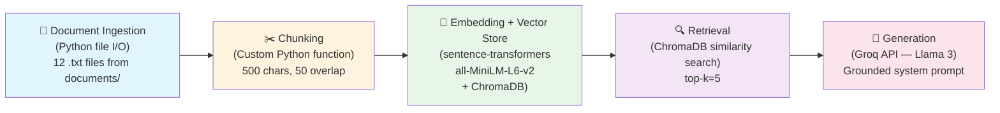

# Project 1 Planning: The Unofficial Guide

> Write this document before you write any pipeline code.
> Your spec and architecture diagram are what you'll use to direct AI tools (Claude, Copilot, etc.) to generate your implementation — the more specific they are, the more useful the generated code will be.
> Update the Retrieval Approach and Chunking Strategy sections if you change your approach during implementation.
> Update this file before starting any stretch features.

---

## Domain

Off-campus survival guides for college students who work part-time. This domain covers the practical, day-to-day knowledge that working students need but can't find in one place: budgeting on minimum wage, finding apartments, balancing work shifts with class schedules, meal prepping on a tight budget, staying safe in off-campus housing, avoiding burnout, and navigating employer tuition benefits. This knowledge is valuable because it's scattered across dozens of Reddit threads, personal finance blogs, and student life articles — and university websites almost never address the reality of students who must work to survive.

---

## Documents

<!-- List your specific sources: URLs, subreddit names, forum threads, or file descriptions.
     Aim for at least 10 sources that together cover different subtopics or perspectives within your domain. -->

| # | Source | Description | URL or location |
|---|--------|-------------|-----------------|
| 1 | Fastweb | College housing options: dorms vs off-campus decision guide | https://www.fastweb.com/student-life/articles/how-to-pick-housing-for-college-students |
| 2 | Fastweb | How to juggle part-time work and scholarship applications | https://www.fastweb.com/student-life/articles/how-to-juggle-part-time-work-and-scholarship-applications |
| 3 | Fastweb | Fast food jobs that pay for college tuition (tuition assistance programs) | https://www.fastweb.com/student-life/articles/four-fast-food-jobs-thatll-pay-your-college-tuition |
| 4 | CNBC Select | 5 budgeting tips for college students | https://www.cnbc.com/select/budgeting-tips-for-college-students/ |
| 5 | Budget Bytes | Budget-friendly meal prep ideas and strategies | https://www.budgetbytes.com/category/extra-bytes/budget-friendly-meal-prep/ |
| 6 | Reddit r/personalfinance | Personal finance guide for young adults and working students | https://www.reddit.com/r/personalfinance/wiki/young_adult |
| 7 | Reddit r/college | Tips for commuting students who work part-time | https://www.reddit.com/r/college/ |
| 8 | Reddit r/college | Off-campus apartment hunting tips for students | https://www.reddit.com/r/college/ |
| 9 | Reddit r/college | How to stay safe living off-campus | https://www.reddit.com/r/college/ |
| 10 | Reddit r/college & r/GetMotivated | Avoiding burnout as a working student | https://www.reddit.com/r/college/ |
| 11 | Reddit r/LifeProTips | Time management hacks for students with jobs | https://www.reddit.com/r/LifeProTips/ |
| 12 | Reddit r/povertyfinance & r/Frugal | Surviving on minimum wage while in school | https://www.reddit.com/r/povertyfinance/ |

---

## Chunking Strategy

<!-- How will you split documents into chunks?
     State your chunk size (in tokens or characters), overlap size, and explain why those
     numbers fit the structure of your documents.
     A review-heavy corpus warrants different chunking than a long FAQ. -->

**Chunk size:** 500 characters

**Overlap:** 50 characters

**Reasoning:** My documents are structured guides with headers and bullet-pointed advice, averaging 4,000–7,000 characters each (roughly 60–90 lines). Key facts are typically contained within 2–4 sentences or a single bullet-point section. A 500-character chunk captures one complete piece of advice (e.g., one budgeting tip, one safety strategy, or one meal prep idea) without mixing unrelated topics. This is large enough to preserve context but small enough that retrieval returns focused, relevant answers rather than diluted multi-topic blocks. The 50-character overlap ensures that advice items split at section boundaries still have enough leading/trailing context to be independently understandable — for example, if a tip about "rent splitting" starts near the end of one chunk, the overlap carries the beginning into the next chunk so neither half is orphaned.

---

## Retrieval Approach

<!-- Which embedding model are you using (e.g., all-MiniLM-L6-v2 via sentence-transformers)?
     How many chunks will you retrieve per query (top-k)?
     If you were deploying this for real users and cost wasn't a constraint, what tradeoffs
     would you weigh in choosing a different embedding model — context length, multilingual
     support, accuracy on domain-specific text, latency? -->

**Embedding model:** `all-MiniLM-L6-v2` via `sentence-transformers`. This model produces 384-dimensional embeddings, runs locally without API costs, and handles English informal text (Reddit-style writing, casual advice) well.

**Top-k:** 5 chunks. My documents contain focused, distinct topics (budgeting vs. safety vs. meal prep), so 5 chunks should surface enough relevant context without flooding the LLM with off-topic material. If retrieval quality is poor, I'll experiment with k=3 (more focused) or k=7 (broader context).

**Production tradeoff reflection:** For a real deployment, I'd consider:
- **`all-mpnet-base-v2`** (768 dimensions): Higher accuracy on semantic similarity benchmarks but 2x slower and larger model size. Worth it if retrieval precision matters more than latency.
- **OpenAI `text-embedding-3-small`**: Better performance on domain-specific text and longer context windows (8191 tokens), but requires API calls ($0.02/1M tokens) and adds latency. Would be necessary if documents were multilingual.
- **Context length**: `all-MiniLM-L6-v2` handles up to 256 tokens per input — my 500-character chunks are ~100-125 tokens, so this is fine. Longer documents or bigger chunks would require a model with a larger context window.
- **Latency**: Local models (sentence-transformers) have ~5-10ms per embedding. API-based models add 100-300ms network latency per call, which matters for real-time search.

---

## Evaluation Plan

<!-- List your 5 test questions with their expected correct answers.
     Questions should be specific enough that you can judge whether the system's response
     is right or wrong. "What are good dining halls?" is too vague.
     "What do students say about wait times at [dining hall name] during lunch?" is testable. -->

| # | Question | Expected answer |
|---|----------|-----------------|
| 1 | How much tuition assistance does Starbucks offer student employees? | Starbucks offers a 42% CAP Scholarship up front plus covers remaining tuition at ASU's online program, valued at over $47,000 total. Employees must be working on their first bachelor's degree and complete FAFSA. |
| 2 | How many hours per week should a full-time student work before grades start to suffer? | 10-15 hours/week is generally manageable; 15-20 is doable but grades may dip slightly; 20-25 is the risk zone with high burnout potential; 25+ is not recommended for full-time students. |
| 3 | What are the hidden costs beyond rent that students should budget for when moving off-campus? | Security deposit, first+last month's rent, utilities ($30-80 electric, $20-50 gas, $20-40 water, $40-60 internet), renter's insurance ($10-20/month), furniture, kitchen basics ($100-200), and laundry ($20-40/month). |
| 4 | What should a student do to stay safe when walking home from a late work shift? | Share live location with a trusted person, walk in well-lit areas, keep headphones off/low volume, carry a flashlight, have keys in hand before reaching the door, use campus safety escort services, and trust your gut if something feels wrong. |
| 5 | What's a realistic weekly grocery budget and what staple items should a student buy? | $25-40/week. Staples: rice (25lb bag), dried beans/lentils, eggs, bananas, frozen vegetables, bread, peanut butter, oats, chicken thighs (family pack). Shop at Aldi/Lidl/ethnic grocery stores for 30-50% savings. |

---

## Anticipated Challenges

<!-- What could go wrong? Name at least two specific risks with reasoning.
     Consider: noisy or inconsistent documents, missing source attribution, off-topic
     retrieval, chunks that split key information across boundaries. -->

1. **Cross-topic retrieval due to overlapping vocabulary.** Many documents use shared keywords like "budget," "schedule," and "hours." A query about budgeting grocery costs might retrieve chunks about budgeting work hours or time budgeting. Since the embedding model relies on semantic similarity, these semantically adjacent but topically different chunks could dilute the context passed to the LLM, leading to answers that mix unrelated advice.

2. **List items split across chunk boundaries.** Several documents (e.g., the apartment hunting red flags, safety tips, and grocery lists) contain important information as long bulleted lists. A 500-character chunk will inevitably split some lists mid-item. For example, the "hidden costs" list in the apartment guide could be cut so that the first chunk mentions security deposit and utilities, while the second chunk has renter's insurance and furniture — a query about "total move-in costs" might only retrieve half the answer.

3. **Source attribution ambiguity.** Multiple documents cover overlapping topics (e.g., both the personal finance doc and the minimum-wage doc discuss grocery budgets). When the system retrieves chunks from multiple sources and synthesizes an answer, it may be unclear which source a specific piece of advice came from, making it hard for users to verify the information.

---

## Architecture

<!-- Draw a diagram of your pipeline showing the five stages:
     Document Ingestion → Chunking → Embedding + Vector Store → Retrieval → Generation
     Label each stage with the tool or library you're using.
     You can use ASCII art, a Mermaid diagram, or embed a sketch as an image.
     You'll use this diagram as context when prompting AI tools to implement each stage. -->

**Pipeline stages detail:**

| Stage | Tool/Library | Input | Output |
|-------|-------------|-------|--------|
| 1. Document Ingestion | Python `open()` / `os` | 12 `.txt` files in `documents/` | Raw text strings with source metadata |
| 2. Chunking | Custom `chunk_text()` function | Raw text per document | List of 500-char chunks with overlap, tagged with source filename |
| 3. Embedding + Storage | `sentence-transformers` + `chromadb` | Chunk text strings | 384-dim vectors stored in ChromaDB collection |
| 4. Retrieval | ChromaDB `.query()` | User query string | Top-5 most similar chunks with metadata |
| 5. Generation | `groq` SDK (Llama 3 model) | System prompt + retrieved chunks + user query | Grounded answer with source citations |

---

## AI Tool Plan

<!-- For each part of the pipeline below, describe:
     - Which AI tool you plan to use (Claude, Copilot, ChatGPT, etc.)
     - What you'll give it as input (which sections of this planning.md, which requirements)
     - What you expect it to produce
     - How you'll verify the output matches your spec

     "I'll use AI to help me code" is not a plan.
     "I'll give Claude my Chunking Strategy section and ask it to implement chunk_text()
     with my specified chunk size and overlap" is a plan. -->

**Milestone 3 — Ingestion and chunking:**
- **Tool:** GitHub Copilot (in VS Code)
- **Input:** The Chunking Strategy section of this planning.md, plus a description of the file structure in `documents/` (12 `.txt` files, each starting with a metadata header separated by `---`).
- **Expected output:** A `chunk_text(text, chunk_size=500, overlap=50)` function that splits text into overlapping chunks, plus an `ingest_documents(directory)` function that reads all `.txt` files, strips the metadata header, and returns chunks tagged with their source filename.
- **Verification:** I'll run the function on one document and manually check that chunks are ~500 chars, overlap correctly, and don't include the metadata header. I'll also count total chunks to confirm reasonable coverage.

**Milestone 4 — Embedding and retrieval:**
- **Tool:** GitHub Copilot (in VS Code)
- **Input:** The Retrieval Approach section and Architecture table from this planning.md, plus the `requirements.txt` showing `sentence-transformers` and `chromadb` dependencies.
- **Expected output:** A script that (1) loads the sentence-transformers model, (2) embeds all chunks, (3) stores them in a ChromaDB collection with source metadata, and (4) provides a `retrieve(query, k=5)` function returning the top-k similar chunks.
- **Verification:** I'll test with my 5 evaluation questions and manually inspect whether returned chunks are from the correct source documents and topically relevant.

**Milestone 5 — Generation and interface:**
- **Tool:** GitHub Copilot (in VS Code)
- **Input:** The Evaluation Plan section, the Groq SDK documentation, and a grounding system prompt I'll write specifying that the model should only answer from retrieved context and cite sources.
- **Expected output:** A `generate_answer(query, retrieved_chunks)` function that formats chunks into a prompt and calls the Groq API, plus a simple Gradio or CLI interface for querying.
- **Verification:** I'll run all 5 evaluation questions and compare system responses against my expected answers. I'll check that the model cites specific sources and refuses to answer when context is insufficient.
